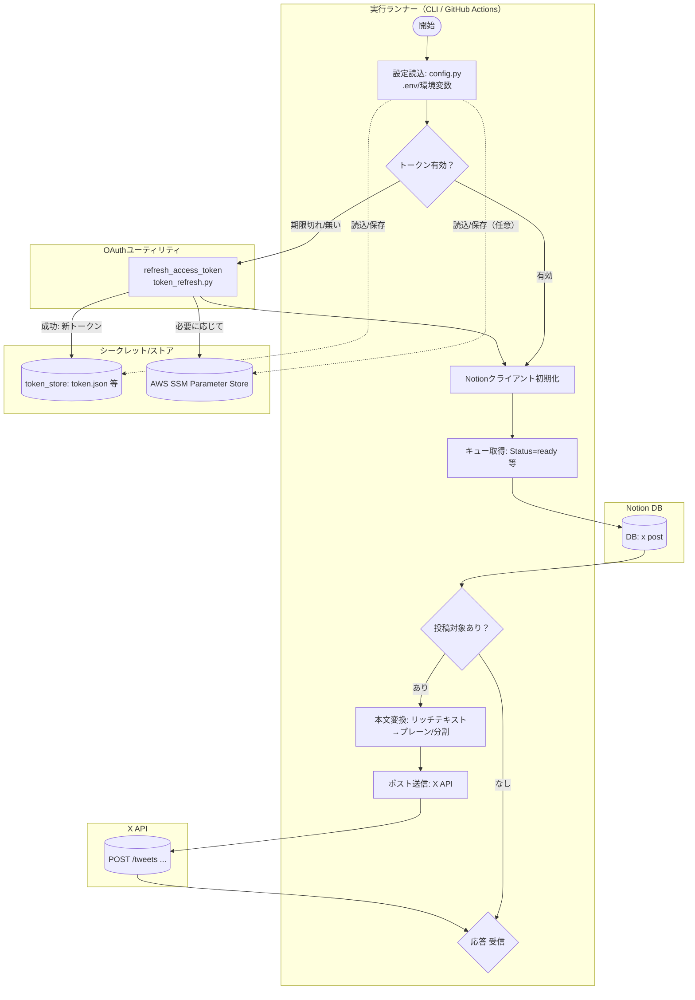
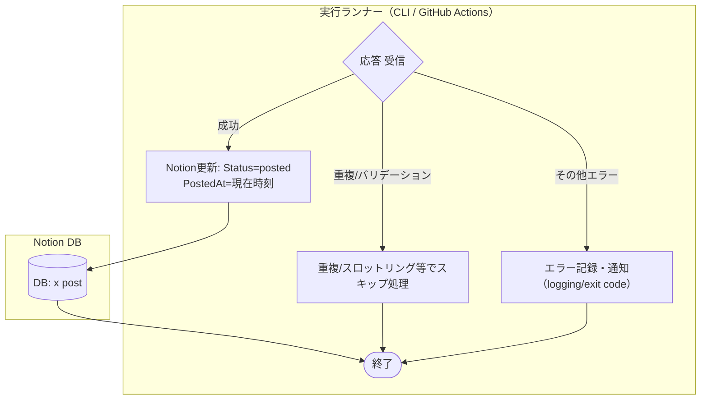

# 投稿パイプライン

## 1) Notion → X ポスト — 前半（送信まで）

```mermaid

flowchart TD
  subgraph Runner[実行ランナー（CLI / GitHub Actions）]
    A0([開始])
    A1[設定読込: config.py<br/>.env/環境変数]
    A2{トークン有効？}
    A6[Notionクライアント初期化]
    A7[キュー取得: Status=ready 等]
    A8{投稿対象あり？}
    A9[本文変換: リッチテキスト→プレーン/分割]
    A10[ポスト送信: X API]
    A11{応答 受信}
  end

  subgraph Secrets[シークレット/ストア]
    S1[(token_store: token.json 等)]
    S2[(AWS SSM Parameter Store)]
  end

  subgraph OAuth[OAuthユーティリティ]
    R1[refresh_access_token<br/>token_refresh.py]
  end

  subgraph Notion[Notion DB]
    N1[(DB: x post)]
  end

  subgraph XAPI[X API]
    T1[(POST /tweets ...)]
  end

  A0 --> A1 --> A2
  A2 -- 有効 --> A6
  A2 -- 期限切れ/無い --> R1
  R1 -->|成功: 新トークン| S1
  R1 -->|必要に応じて| S2
  R1 --> A6

  A6 --> A7 --> N1
  N1 --> A8
  A8 -- なし --> A11
  A8 -- あり --> A9 --> A10 --> T1 --> A11

  A1 -.->|読込/保存| S1
  A1 -.->|読込/保存（任意）| S2
  
```

## 2) Notion → X ポスト — 後半（応答処理）

```mermaid

flowchart TD
  subgraph Runner[実行ランナー（CLI / GitHub Actions）]
    A11{応答 受信}
    A12[Notion更新: Status=posted<br/>PostedAt=現在時刻]
    A13[重複/スロットリング等でスキップ処理]
    A14[エラー記録・通知（logging/exit code）]
    A15([終了])
  end

  subgraph Notion[Notion DB]
    N1[(DB: x post)]
  end

  A11 -- 成功 --> A12 --> N1 --> A15
  A11 -- 重複/バリデーション --> A13 --> A15
  A11 -- その他エラー --> A14 --> A15

```
